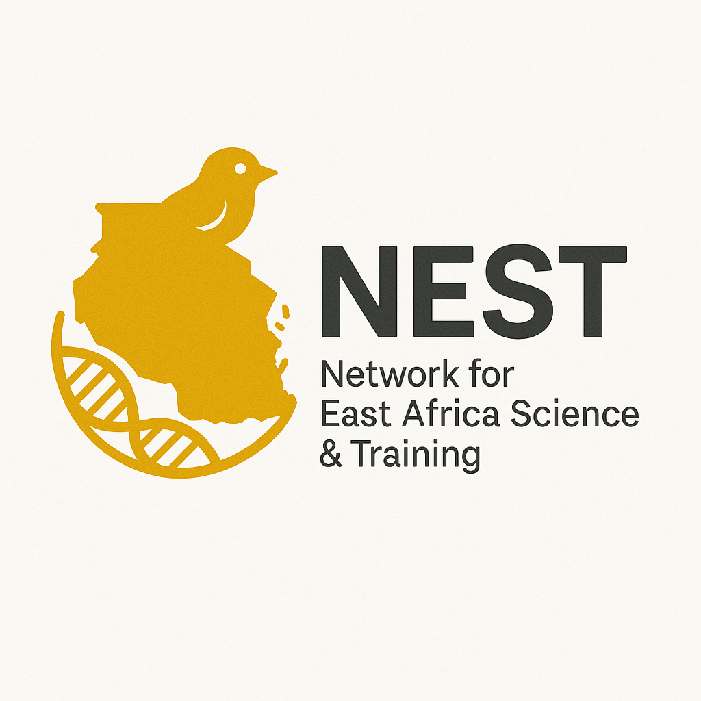

# NEST - Network for East Africa Science and Training

About NEST

Find committee members

Collaboration network

NEST is a group of faculty interested in fostering scientific collaborations in bioinformatics with institutions in East Africa.

1. People and institutions
2. Find potential committee members
3. Collaboration network

## People and institutions

### University of Idaho

Onesmo Balemba

Christine Parent

Luke Harmon

### Virginia Tech University

Josef Uyeda

Elizabeth Daniel

### Nelson Mandela Institute of African Technology

xxx

<html lang="en">
<head>
  <meta charset="utf-8" />
  <meta name="viewport" content="width=device-width, initial-scale=1" />
  <title>NEST Faculty Finder</title>
  <!-- Tailwind (CDN) -->
  
  <!-- Fuse.js for fuzzy search -->
  
</head>
<body class="bg-neutral-50 text-neutral-900">
  <header class="max-w-5xl mx-auto px-4 py-8">
    <h1 class="text-3xl font-extrabold tracking-tight">NEST Faculty Finder</h1>
    

      Search by research keywords (e.g., <em>bioinformatics, genomics, phylogenetics</em>) to find collaborators across East Africa and partner institutions.
    

  </header>

  <main class="max-w-5xl mx-auto px-4 pb-16">
    <!-- Search + filters -->
    

      

        <input id="q" type="search" inputmode="search" placeholder="Search by keywords, topics, institution, country, name…"
               class="w-full border border-neutral-300 rounded-xl px-4 py-3 focus:outline-none focus:ring-2 focus:ring-emerald-500"
               aria-label="Keyword search" />
        <select id="countryFilter" class="border border-neutral-300 rounded-xl px-3 py-3 focus:outline-none focus:ring-2 focus:ring-emerald-500 w-full md:w-64" aria-label="Country filter">
          <option value="">All countries</option>
        </select>
      

      

        <label class="inline-flex items-center gap-2 text-sm">
          <input id="exactMatch" type="checkbox" class="w-4 h-4 rounded border-neutral-300">
          Exact match
        </label>
        <button id="clearBtn" class="ml-auto text-sm underline underline-offset-4">Clear</button>
      

    

    <!-- Results summary -->
    

    <!-- Results grid -->
    

    <!-- Empty state -->
    <template id="emptyTpl">
      

        
No matches found

        
Try different keywords or clear filters.

      

    </template>

    <!-- Card template -->
    <template id="cardTpl">
      <article class="bg-white rounded-2xl shadow hover:shadow-md transition p-5 flex flex-col gap-2">
        <h2 class="text-lg font-bold"></h2>
        

        

        

        

      </article>
    </template>
  </main>

  <footer class="max-w-5xl mx-auto px-4 pb-10 text-xs text-neutral-500">
    NEST — Network for East Africa Science &amp; Training
  </footer>

  
</body>
</html>

## Collaboration Network

(webapp here)
